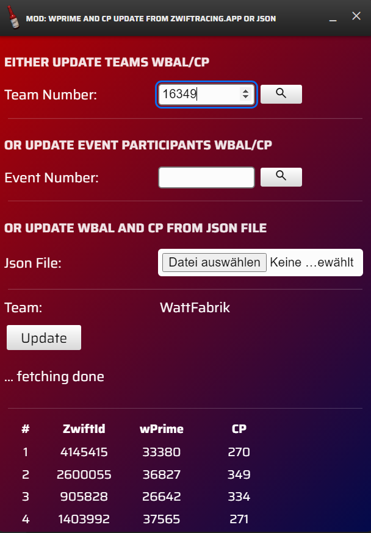
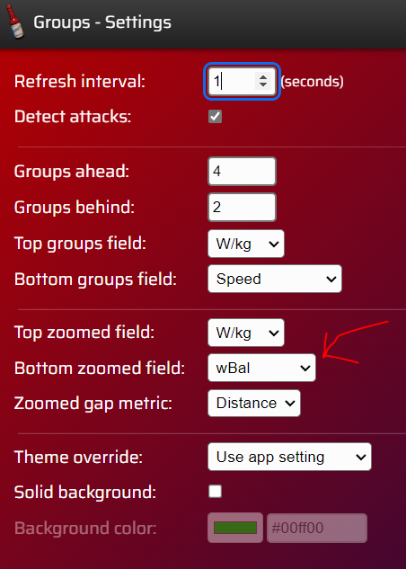
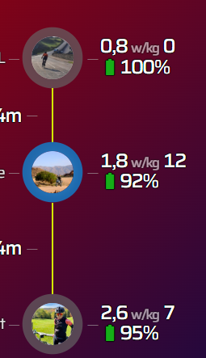

A MOD collection for Sauce for Zwift™
===========

You need to place this Sauce for Zwift "Mod" into this directory ~/Documents/SauceMods/dosenhuhn_s4z_mods


Requirements:
--------
Sauce for Zwift™ 
### https://github.com/SauceLLC/sauce4zwift
for Mac / Windows / Linux:
### https://sauce.llc/products/sauce4zwift/download

Included Mods:
--------


#### wprime and cp update


This window will fetch the wprime and cp data for either 
- `<teamid>` of all registered riders from `https://www.zwiftracing.app/clubs/<teamid>`
- `<eventid>` of all registered riders from `https://www.zwiftracing.app/events/<eventid>`
- local json file with following structure:
```
[
  {
    "name": "<Name>", 
    "athleteId": <ZwiftId>, 
    "wPrime":<wprime_in_joule>, 
    "cp":<cp_in_watt>
  },
  {
    ...
  }
]
```

#### groups
The groups mod shows the team badge from the watched rider and teammates left of the bubbles. In zoomed view it will always show as first line <power> or <power/kg> and draft. For the second line it is possible to choose wBal.



