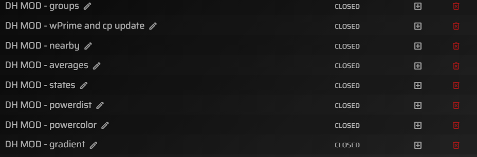

A MOD collection for Sauce for Zwift™
===========

You need to place this Sauce for Zwift "Mod" into this directory ~/Documents/SauceMods/dosenhuhn_s4z_mods

Requirements:
--------
Sauce for Zwift™ 
### https://github.com/SauceLLC/sauce4zwift
for Mac / Windows / Linux:
### https://sauce.llc/products/sauce4zwift/download

Included Mods:
--------

### wbal event update

This window will fetch the wprime and cp data for the given `<eventid>` of all registered riders from `https://www.zwiftracing.app/events/<eventid>`

### wbal team update

This window will fetch the wprime and cp data for the given `<teamid>` of all team-riders from `https://www.zwiftracing.app/clubs/<teamid>`

